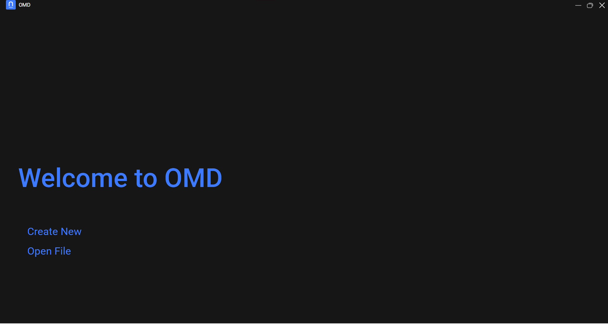
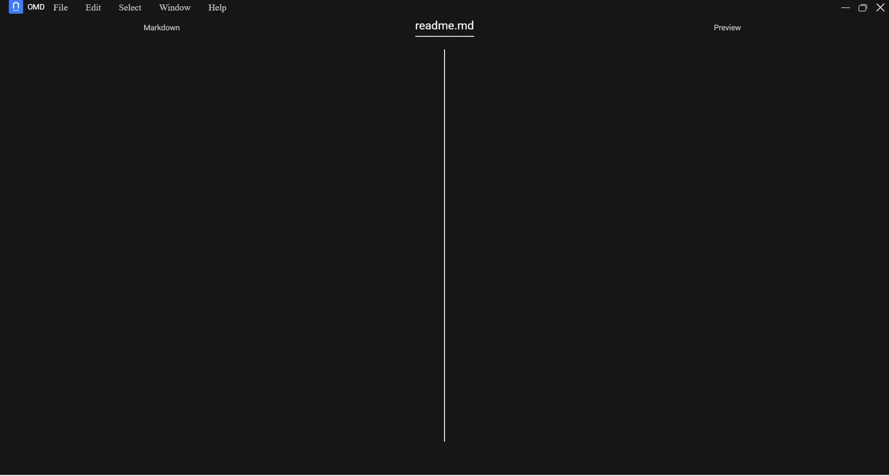

<div align="center">

</div>


# OMD


# What is it

OMD - a simple program that just allows you to simply preview markdown text


# How to run

### Install dependencies
```shell
npm i
```

### Run dev
```shell
npm run dev
```

### Or build app
```shell
# Windows
npm run build:win
# MacOS
npm run build:mac
# Linux
npm run build:linux
```

# Screens



